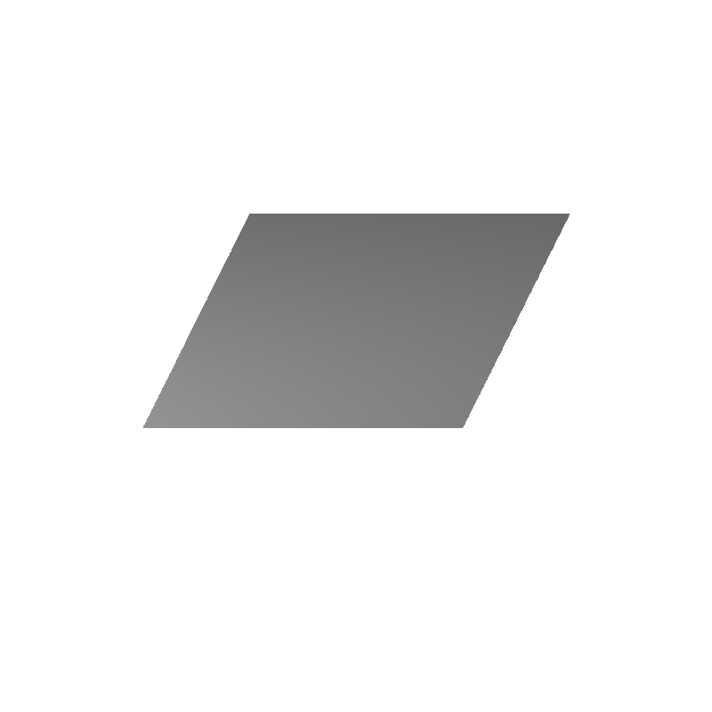
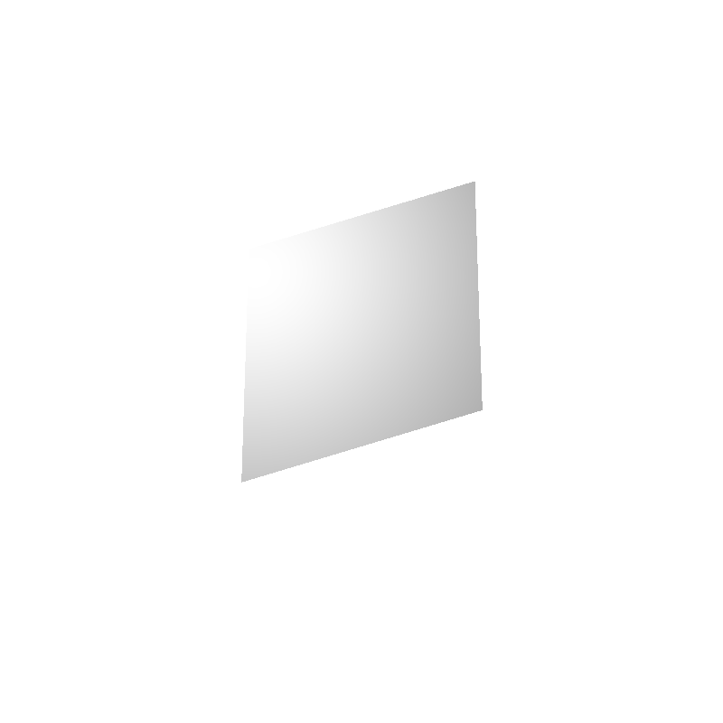
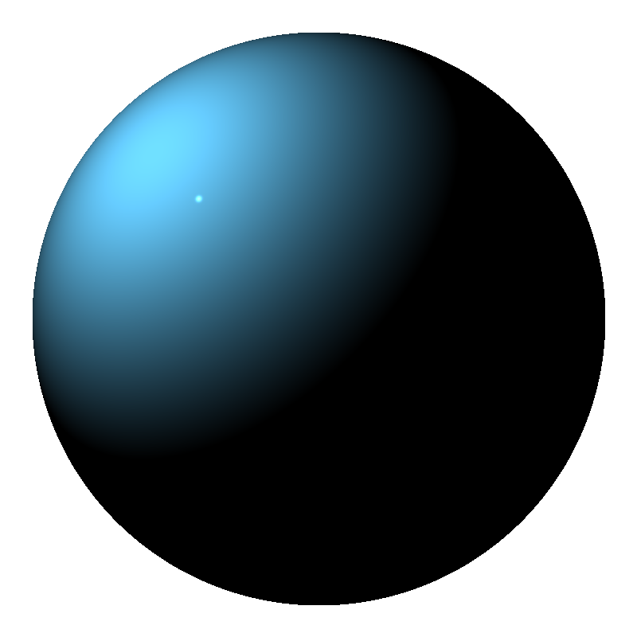

# Assignment 2

###### Zander Mao zm800

## Description

The code implements basic rendering functions, including orthogonal image of a parallelogram, a perspective image of a parallelogram, and a orthogonal image of a sphere with basic shading. Light source is at (-1, 1, 1) for all image. The results are below.

## Parallelogram (orthogonal)

Implement functions to compute whether ray intersects with the parallelogram and the function to compute the normal of the intersection point.

</img>

## Parallelogram (perspective)

Implemented function to compute the intersection point in 3D. The perspective can be seen from the left and right edge of the parallelogram. Since the image is perspective, the two edges are not parallel.

</img>

## Sphere (perspective with shading)

Generated specular shading. Create glossy surface. Change the color of the sphere by modifying the portions of the RGB channels. Create functions to compute specular shading with Phong & Blinn's formula.

</img>
