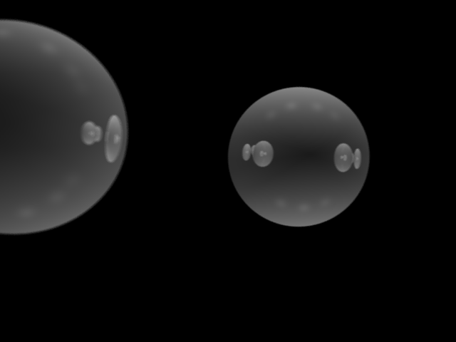

# Assignment 3

###### Zander Mao zm800

## Description

The code implements more shading functions, including perspective camera, depth of field and reflection. Refraction was tried but not successful. scene.json is modified to get similar result comparing to the given result image.

## Result

</img>
