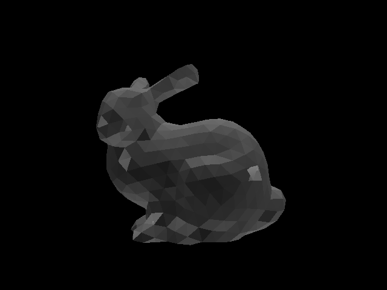

# Assignment 4

###### Zander Mao zm800

## Description

The code builds an AABBTree using Top-down approach and iterative method to speed up rendering. Also, methods for reflection are also implemented. It is found that dividing boxes according to the axis iteratively will gives a more balanced tree. To make the code run faster, camera lens radius is set to 0 and depth of field is not implemented. However, it is possible if one changes the iter variable in the main function to a bigger number and set the correct camera lens radius in the scene file.

## Result

</img>
</img>